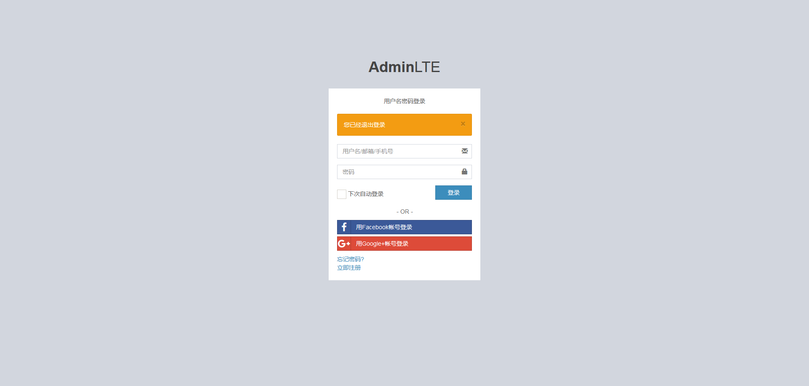
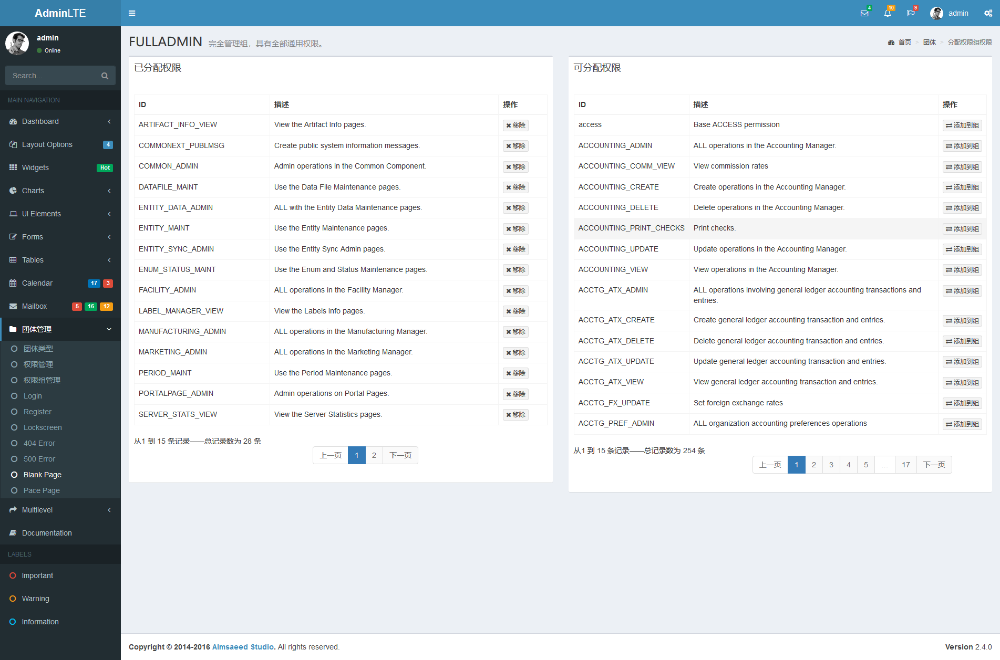
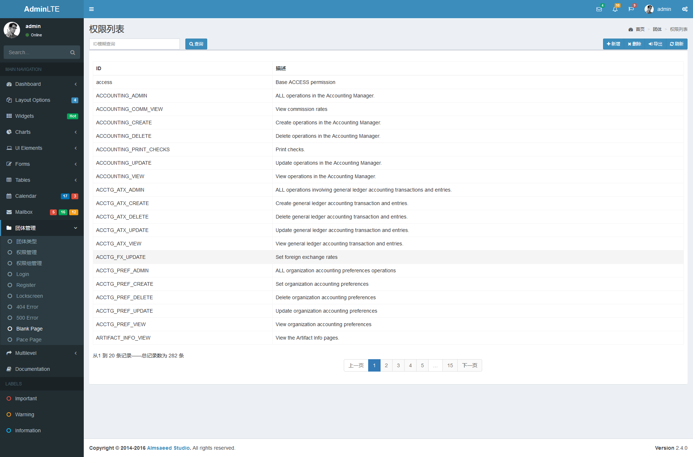
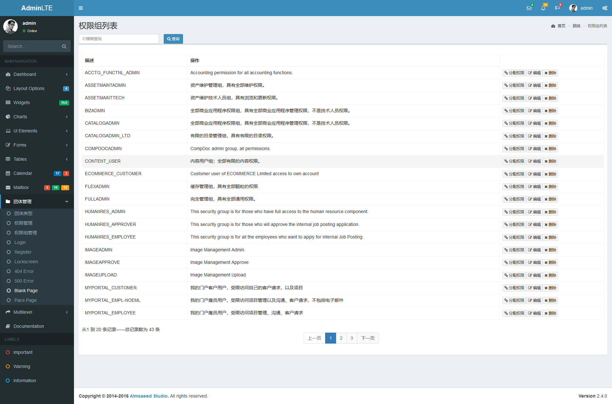
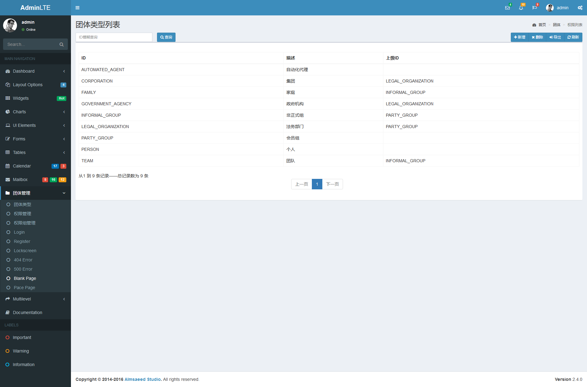

### 1.系统说明
示例人力资源管理系统，包含权限分配，员工管理，薪资管理，考勤管理
### 2.技术栈
* JDK1.8
* SpringBoot 2.1.0.RELEASE
* Spring Security 5.1作为安全控制框架
* MySQL数据库
* Mybatis 作为OR-Mapping框架
* Freemarker前台模版
* AdminLTE-2.4.5 为基础作为前台展示
* 参考apache-ofbiz-16.11.05 的权限和人员组织模型
* jQuery Datatable表格组件做数据展示
### 3.运行系统
* 将数据库脚本[hrm.sql](hrm.sql)导入到mysql数据库中
* 修改数据库配置项[application.yml](hrm-config/src/main/resources/application.yml)
* 运行[Application.java](hrm-web/src/main/java/com/github/kwang2003/hrm/Application.java)
* 访问[http://localhost:8080](http://localhost:8080)
* 用户名1：admin 密码：password
* 用户名2：user 密码：123456
### 3.系统截图（部分）

